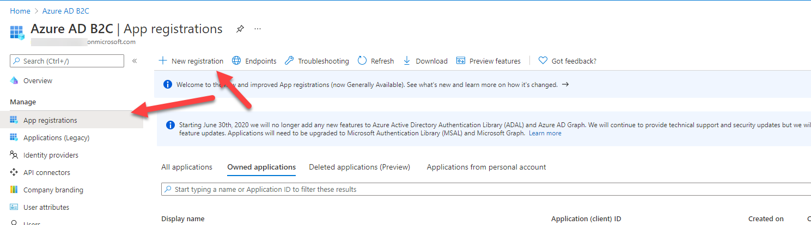
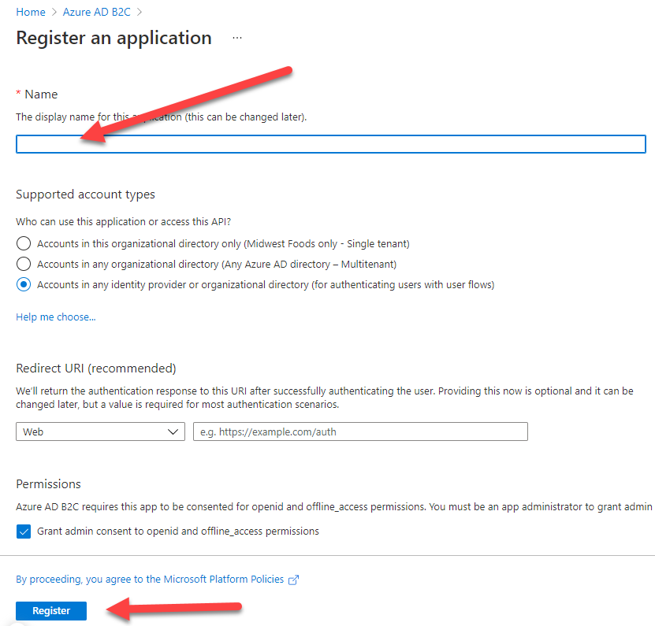
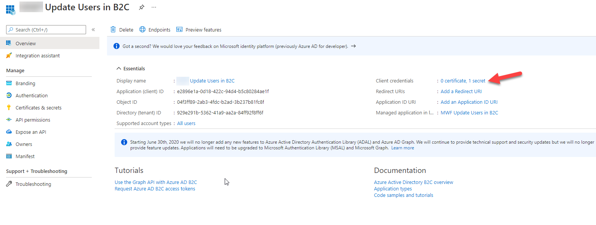
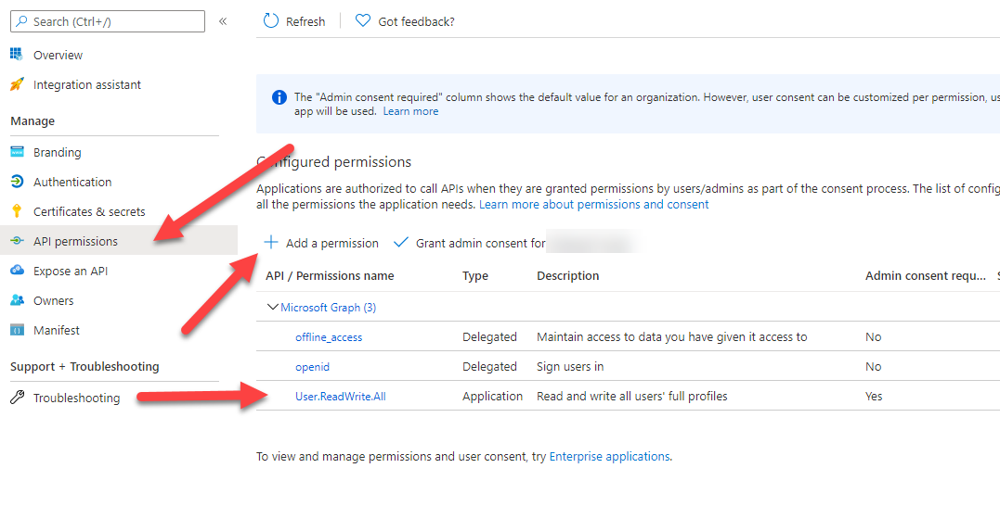
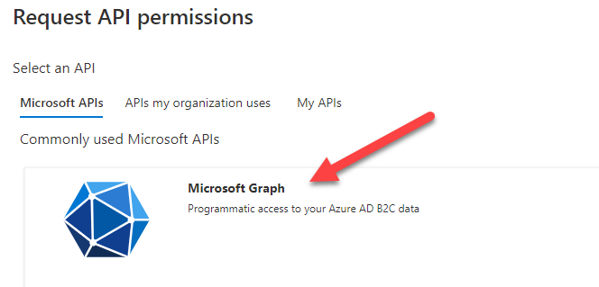
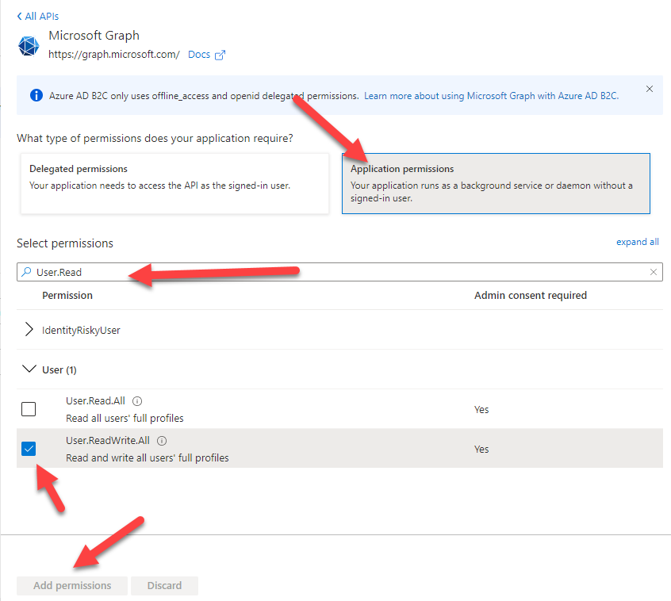
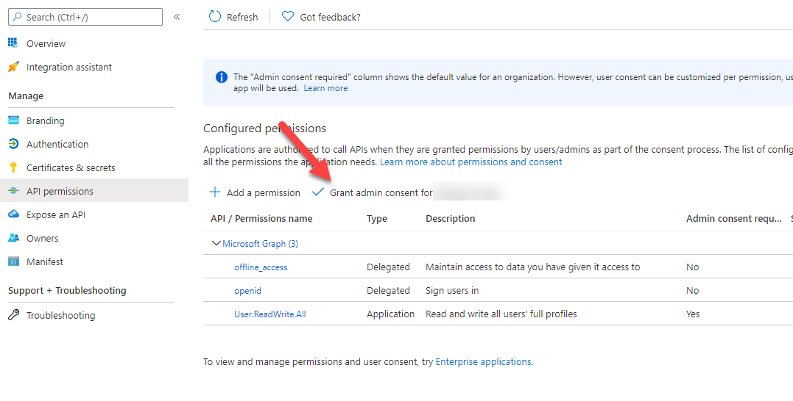

## Quick AAD B2C User Management
The purpose of this is to demonstrate user management of User's in Azure AD B2C.

This is not a full application. It is just for demonstration purposes only.

### appsettings.json explained
```json
{
  "ApiAuthConfiguration": {
    "TenantId": "your_tenant_subdomain.onmicrosoft.com",
    "ApiClientId": "API Application (client) ID",
    "ApiClientSecret": "Create a secret for the Web API",
    "ExtensionAppId": "b2c-extensions-app Application (client) ID"
  },
  "WhatToProcess": {
    "AddUser": false,
    "AddClaim": false,
    "ListUsers": false,
    "DeleteUser": false,
    "ChangeUserPassword": false,
    "AddClaimModel": {
      "UserId": "123456-",
      "AttributeName": "",
      "ClaimValue": ""
    },
    "AddUserModel": {
      "DisplayName": "",
      "GivenName": "",
      "Surname": "",
      "Email": "",
      "Password": ""
    },
    "DeleteUserModel": {
      "UserId": "123456-"
    },
    "ChangeUserPasswordModel": {
      "UserId": "123456-",
      "NewPassword": ""
    }
  }
}
```
The ApiAuthConfiguration will come from Azure. See below on how to register the application.

The ApiAuthConfiguration section:
* TenantId - This is the "Resource name" in the overview section of the B2C resource.
* ApiClientId - This is the "Application (client) ID" for the application you will create below.
* ApiClientSecret - This is the Client Secret you will create below. You want the "Value" not the "Secret ID."
* ExtensionAppId - When a B2C tenant is created an b2c-extensions-app is also created. You will find this in the "App registrations" section under "All applications". You want the "Application (client) ID" but without the hyphens. 

The WhatToProcess section is what you want the program to do:
* AddUser - Will add a user in the AddUserModel section
* AddClaim - Will add the claim to the user in the AddClaimModel. The UserId is the Id. The AttributeName is the **Custom Attribute**
* ListUsers - Will display all users in the directory.
* DeleteUser - Will delete the user specified in the DeleteUserModel.UserId. **Careful** There is no confirmation.
* ChangeUserPassword - Will change the User's password as specified in the ChangeUserPasswordModel

### Creating an application in Azure AD B2C.

Create a B2C tenant:
https://docs.microsoft.com/en-us/azure/active-directory-b2c/tutorial-create-tenant

Create an Daemon Application for this Console App:




Once registered:
Add a secret which you will use in the appsettings



Then you want the application access to Microsoft Graph to be able to do the updated



In the Add Permission page, you want to select Microsoft Graph



Then Application Permissions and look for User.ReadWrite.All and select it, and click on Add permission on the bottom.



You will then need to "Grant admin consent for ..."




 